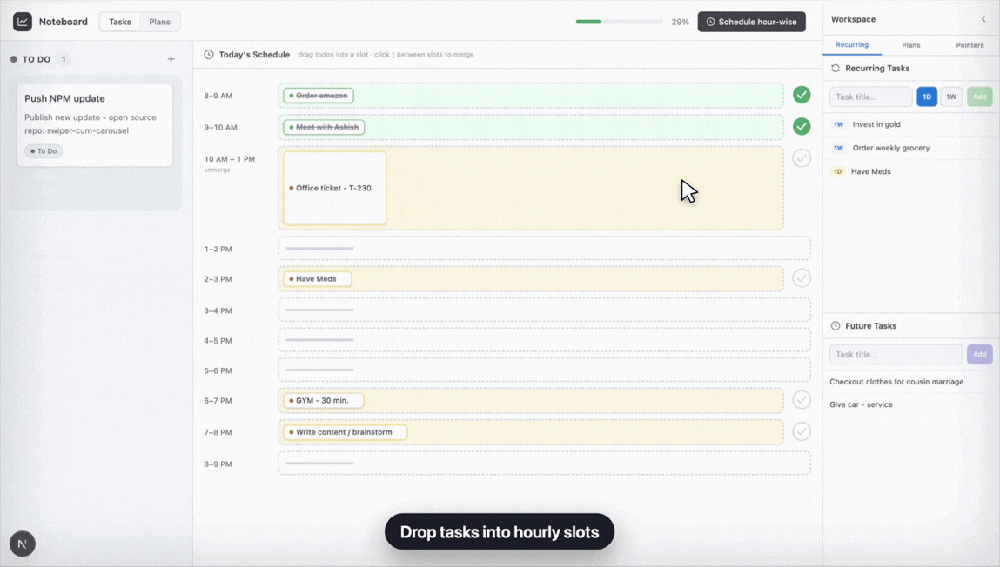

# noteboard

> your tasks. your plans. your notes. zero drama.

a clean, minimal workspace that lives entirely in your browser. no accounts, no backend, no subscription. just open it and get to work.

---

## preview



---

## highlights

- **kanban task board** with To Do, In Progress, Complete, and Blocked columns
- **hour-wise schedule mode** for turning today's tasks into a simple timeline
- **plans workspace** for goals, rich notes, idea cards, and useful links
- **right-side command panel** for recurring tasks, future tasks, quick plans, and pointers
- **local-first storage** with automatic saves in your browser
- **native drag and drop** with no external UI framework or backend dependency

---

## features

**4 columns that actually make sense**

| column | vibe |
|---|---|
| To Do | the list that haunts you |
| In Progress | where things actually happen |
| Complete | dopamine hits only |
| Blocked | honest about it, at least |

**schedule mode** lets you drag tasks into hourly slots, merge adjacent blocks, remove tasks from the day plan, and mark a whole slot complete.

**plans** give bigger ideas a place to breathe: goals, notes, links, and small idea cards all live together.

**workspace sidebar** keeps recurring tasks, future tasks, plans, and pointers close by without crowding the board.

everything saves automatically to `localStorage`. refresh, close the tab, come back tomorrow — it's all there.

---

## quickstart

```bash
git clone <your-repo-url>
cd noteboard
npm install
npm run dev
```

open [http://localhost:3000](http://localhost:3000) and you're done.

---

## how to use it

**add a task** — click `+` next to any column header, or the dashed area when a column is empty

**move a task** — drag it to another column, or hit the `···` menu on any card → Move to

**edit a task** — `···` menu → Edit, or just double-tap the card

**schedule tasks** — switch on `Schedule hour-wise`, then drag tasks into the timeline

**plan bigger work** — open the Plans tab for goals, notes, links, and idea cards

**capture later work** — use the workspace sidebar for recurring tasks, future tasks, quick ideas, and pointers

---

## built with

- **Next.js 16** — app router
- **React 19**
- **Tailwind CSS v4**
- **TypeScript**
- **localStorage** — the only database you need

zero external UI libraries. drag and drop is native HTML5.

---

## project structure

```
app/
  page.tsx          <- main board state and layout
  layout.tsx
  globals.css

components/
  TaskCard.tsx              <- individual card actions
  Column.tsx                <- drop zone + add task form
  ScheduleView.tsx          <- hour-wise task schedule
  PlansView.tsx             <- full plans workspace
  NotesPanel.tsx            <- right workspace sidebar
  RecurringTasksPanel.tsx   <- recurring task controls

lib/
  types.ts          <- shared types + COLUMNS config
  storage.ts        <- localStorage read/write
```

see [`DEVELOPER_NOTES.md`](./DEVELOPER_NOTES.md) for architecture deep-dive.

---

## deploy

```bash
npm run build
npm run start
```

or one-click on [Vercel](https://vercel.com) — it just works.

---

made with ☕ and a strong opinion that productivity apps should not require a login
